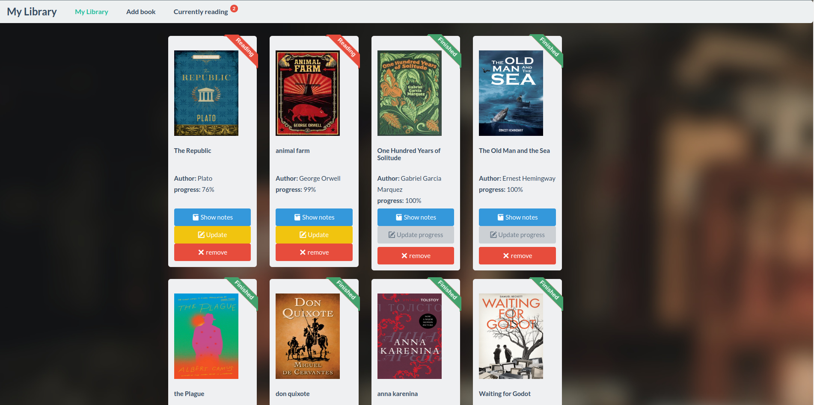
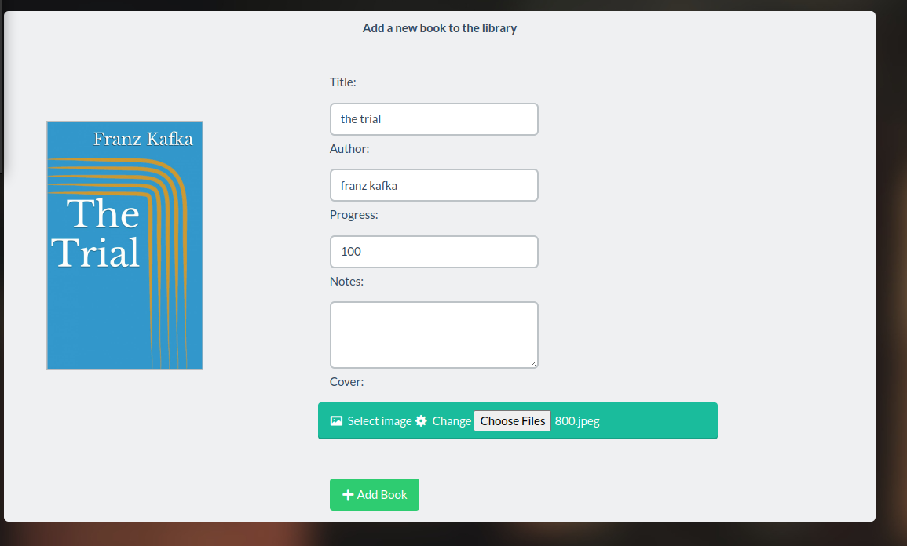

# Book Library
This is a simple web application built using flask. It is used to manage list of books by tracking the reading progress and taking notes about books.

The application uses a postgres database to persist the book information like:
* The book title
* The book author
* reading progress
* notes 

It implements all CRUD operations:
* **C**reate: add a book from the UI and a cover 
* **R**ead: Show the books library items
* **U**pdate: update the reading progress and the taken notes of a book
* **D**elete: Delete a book from the library

# How to install ?

## Setup postgres database

### Install postgres
We start by installing the postgres server and the related tools using the package manager `apt`
~~~bash
sudo apt update
apt install -y postgresql-14
~~~

### Create database and user
Once the database is installed we create the `books` database and a user `books_manager` with a password.
Last but not least, we grant all privileges on the database we just created to the user `books_manager`.
So that we use that user to query the database and perform multiple operations on it.
THe first below steps should be done with user **postgres** that user will be automatically added during the installation of postgres.

#### Switch to user postgres
We should switch to the user postgres to be able to locally connect to the postgres database.

~~~bash 
# go as root
sudo su 
# switch to user postgres
su -l  postgres 
# now we issue psql command to locally connect to postgres
psql 
~~~

#### Create Postgres database books and user
~~~sql
CREATE database books;
CREATE user books_manager with encrypted password 'xxx';
GRANT all privileges on database books to books_manager;
~~~

### Import data into the database
We do not want to start with an empty database, so we import the first entries from an **SQL dump** so later when we start our web application
It will nicely show the books entries.

~~~bash
cd mylibrary
psql -h localhost -d books -U books_manager < books.sql
~~~

## Install the app

### Install python and pip
Once the database is ready we start by installing the web application.

We start by installing python and `pip` (The package manager of python):

~~~bash 
sudo apt install python3-dev python3-pip libpq-dev
~~~

### Install application requirements
Our application is built using flask and uses `gunicorn` to run, It also uses `SQLAlchemy` to connect to the database and perform different queries.
These dependencies must be first installed. All the requirements are specified in [requirements.txt](requirements.txt).

To install these requirements we do:

~~~bash 
# we go into mylibrary root folder
cd mylibrary
pip3 install -r requirements.txt
~~~

### Start the web application 

The web application is now ready to be started using `gunicorn`.

~~~bash 
# go into mylibrary folder that is inside the mylibrary root folder
cd mylibrary/mylibrary
export PATH="$PATH:/home/monitoring/.local/bin"
gunicorn -w 4 mylibrary.server:app --bind 0.0.0.0:8080
~~~

